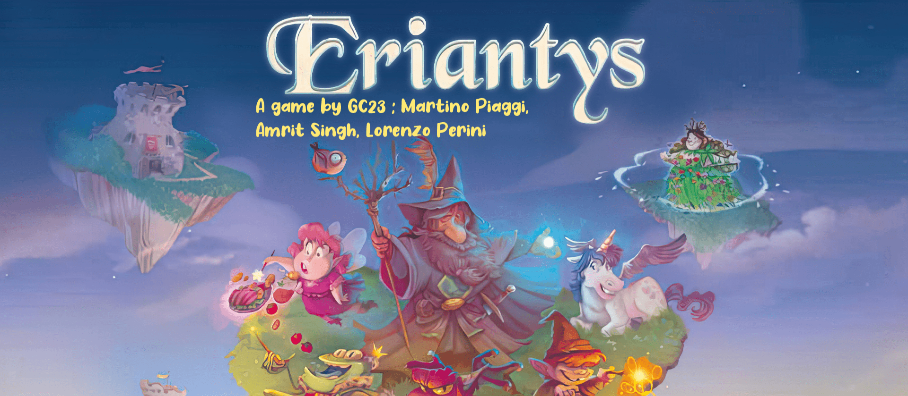

# Prova Finale di Ingegneria del Software - AA 2021-2022

The project's objective is to implement [Eriantys](https://www.craniocreations.it/prodotto/eriantys/) a board game,
using the MVC pattern. The project covers all rules of the game, including 4 player game and expert mode, and enables to
play in two ways: command line interface(CLI) or graphical user interface(GUI), the network is made by using the RMI
method.

### [UML](https://github.com/martinopiaggi/ing-sw-2022-Piaggi-Perini-Singh/tree/master/deliverables/UML)

In the deliverables folder there are two types of UML diagrams:

* [Simple UML](https://github.com/martinopiaggi/ing-sw-2022-Piaggi-Perini-Singh/tree/master/deliverables/UML/Initial%20UML):
  contains only the definition of the various classes, without minor details

* [Complete UML](https://github.com/martinopiaggi/ing-sw-2022-Piaggi-Perini-Singh/tree/master/deliverables/UML/Final%20UML):
  contains the fully detailed diagrams of each class, grouped appropriately and generated by Intellij

### JavaDoc
JavaDoc comments have been added to all classes contained in the project, in order to make the project much more
readable and comprehensible A ogni classe del progetto sono stati aggiunti i commenti JavaDOC in modo da rendere
facilmente leggibile e comprensibile il codice implementato

### Test cases
**Coverage criteria: code lines.**

| Package | Coverage |
|:-----------------------|:------------------:|
| Controller | 92.5% (37/40) |
|model| 89.8% (686/764)|
|model.cards| 100% (3/3)|
| model.cards.assistantcard| 100% (3/3)|
|model.cards.charactercard| 81.6% (142/174)|
|model.deck| 83.3% (10/12)|
|model.deck.assistantcard| 89.5% (17/19)|
|model.deck.characterdeck| 100% (11/11)|
|model.enumerations|100% (42/42)|
|model.tiles|100% (37/37)|

### LIB & Plugins
Plugins|Description
----------------|------------
Maven | Managing tool of project based on Java and built automation
GSON  | Open source Java library used for serializing and deserializing java objects on JSON
JUnit | JUnit is a unit testing framework for the Java programming language
JavaFX| JavaFX is a software platform for creating and delivering desktop applications

### Jars
The project's jar can be downloaded from here: [eriantys.jar]()

## Features
### Developed Features
* Complete Rules
* CLI
* GUI
* RMI

### Advanced Features
* All 12 character cards
* 4 players game
* Multiple games

## Execution
### Running the game
| Command |Role |
|:-----------------------|:------------------|
| ``java -jar Eriantys.jar -server`` | Server listening on port 23023  |
| ``java -jar Eriantys.jar -cli [ip]`` | CLI interface |
| ``java -jar Eriantys.jar -gui [ip]`` | GUI interface |

## Team GC23
- [__Amrit Singh__](https://github.com/10610426) 10610426 amrit.singh@mail.polimi.it
- [__Martino Piaggi__](https://github.com/martinopiaggi) 10686518 martino.piaggi@mail.polimi.it
- [__Lorenzo Perini__](https://github.com/Sunriser45) 10676180 lorenzo1.perini@mail.polimi.it